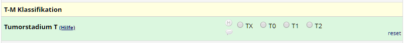
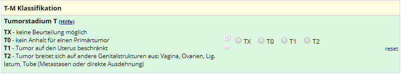

# REDCap Field Help

A REDCap External Module that provides field help toggles.

## Purpose / Use Case

In some cases it may be useful to present data entry or survey users with additional information on request only. A simple way to achieve this is to provided this information initially hidden and show it in response to some trigger action such as clicking a link or button.

## Effect

When enabled for a project, HTML elements (e.g. \<button>, \<a>, \<div>) with the attributes `data-toggle-toggle` and `data-toggle-target` will be enhanced so that clicking the toggle-element will toggle the visibility of target elements.

## Requirements

REDCAP 8.1.0 or newer (tested with REDCap 9.0.0 on a system running PHP 7.0.33).

## Installation

- Clone this repo into `<redcap-root>/modules/redcap_field_help_v<version-number>`, or
- Obtain this module from the Consortium REDCap Repo via the Control Center.
- Go to Control Center > Technical / Developer Tools > External Modules and enable REDCap Survey Auth.
- Enable the module for each project that needs the functionality provided by the module..

## Configuration

This external module has no configuration settings.

## Usage

In a field label (or a descriptive field), add a clickable element (e.g. an anchor tag `<a>` or a `<button>`) with the attribute `data-toggle-toggle` and optionally specifying a value that represents the name of the target (when no value is given, targets are assumed to be within the same table row as the  toggling element).

In the same field label (or anywhere else when using names), add an element (e.g. a `<span>` or `<div>`) with the attribute `data-toggle-target` (again with an optional value that represents the name and corresponds to a value used in a toggle element) and the attribute `data-toggle-hidden` (alternatively `hidden`) if the element should be hidden initially. When using `hidden`, the element will be hidden at design-time as well.

Note that for links to be clickable, the `href` attribute has to be present.

### Example field label

```html
Tumorstadium T <a href="#" data-toggle-toggle="t" style="font-size:80%">(Hilfe)</a>
<div data-toggle-hidden data-toggle-target="t" style="font-weight:normal; font-size:90%; margin-top:5px;"><b>TX</b> - keine Beurteilung möglich
<b>T0</b> - kein Anhalt für einen Primärtumor
<b>T1</b> - Tumor auf den Uterus beschränkt
<b>T2</b> - Tumor breitet sich auf andere Genitalstrukturen aus: Vagina, Ovarien, Lig. latum, Tube (Metastasen oder direkte Ausdehnung)</div>
```

Here, the link _'Hilfe'_ is set to toggle the visibility of a `<div>` that is initially hidden (set via the attribute `hidden`). The following screenshots illustrate this.

Initial state:


Toggled state:
